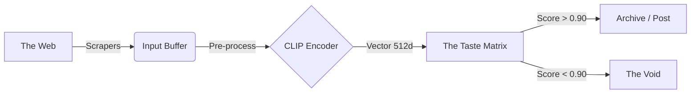

# JANULON

> "The machine does not need to see. It only needs to feel."

Janulon is a subjective aesthetic engine. Unlike generative AI (which creates new noise), Janulon is a curatorial AI designed to filter the digital ocean for specific visual frequencies.

It uses OpenAI's CLIP (Contrastive Language-Image Pre-Training) to map images into high-dimensional vector space, then applies a custom-trained linear probe to determine if a new image aligns with the operator's specific taste.

It is a mirror. You teach it what you love; it finds more of it.

## Architecture

Janulon operates in a continuous loop of three phases: Acquisition, Evaluation, and Curating.



### The Stack

- **Core:** Python 3.9+
- **Tooling:** [uv](https://docs.astral.sh/uv/) (install & run)
- **Vision:** PyTorch + OpenAI CLIP (ViT-B/32)
- **Logic:** Scikit-Learn (Logistic Regression / MLP)
- **Retina (Scrapers):** praw (Reddit), pytumblr, requests

### Directory Structure

```
Janulon/
├── core/
│   ├── brain.py       # The neural logic (CLIP + Classifier)
│   └── trainer.py     # The script that learns your taste
├── retina/
│   ├── tumblr.py      # Scraper for Tumblr
│   └── reddit.py      # Scraper for Reddit/Imgur
├── data/
│   ├── corpus/        # POSITIVE samples (Images you love)
│   └── void/          # NEGATIVE samples (Random noise/memes)
├── main.py            # The execution loop
├── pyproject.toml     # Dependencies and project metadata
└── tests/             # Tests mirroring source structure
```

## Quick Start

### 1. Installation

Clone the repository and install the project (dependency management via `pyproject.toml`). Using [uv](https://docs.astral.sh/uv/) is recommended.

Or with pip:

```bash
pip install -e .
```

### 2. Induction (Training Phase)

Janulon creates a decision boundary based on your curation history.

1. **Fill the Corpus:** Place 50–100 images that represent your target aesthetic into `data/corpus/`.
2. **Fill the Void:** Place 50–100 random images (screenshots, text, bad photos) into `data/void/`.
3. **Run the calibration:**

```bash
python3 core/trainer.py
```

Output: `Janulon_weights.pkl` (the mathematical representation of your taste).

### 3. Observation (Inference Phase)

Once calibrated, run the main loop. Janulon will scrape configured sources, judge images, and save the matches.

```bash
python3 main.py --source reddit --subreddit architecture --threshold 0.85
```

### 4. Testing

- **Framework:** pytest
- **Layout:** Tests live in `tests/`, mirroring the source layout (e.g. `tests/core/test_brain.py`).
- **Naming:** Files `test_<module>.py`; functions `test_<behavior_being_tested>`.

Run tests:

```bash
pytest
```

Every new function, class, or feature must have corresponding tests. Use one behavior per test, Arrange–Act–Assert structure, and minimal fixtures.

## Configuration

### The Threshold (`--threshold`)

The confidence required for Janulon to accept an image.

| Value | Description |
|-------|-------------|
| 0.50 | Permissive. Will let in anything remotely similar. |
| 0.85 | Strict. High quality, distinct style match. **(Recommended)** |
| 0.98 | The God Tier. Only images mathematically nearly identical to your corpus. |

### Sources

Edit `config.yaml` to set your hunting grounds:

- **Reddit:** Subreddits like /r/Brutalism, /r/LiminalSpace, /r/Cyberpunk
- **Tumblr:** Specific aesthetic blogs to traverse reblog trees
- **Local:** A folder of unsorted images to filter

## Development

- **Tooling:** [uv](https://docs.astral.sh/uv/) for installs and running scripts (`uv run pytest`, `uv run python main.py`, etc.).
- **Style:** PEP 8 and PEP 257 (docstrings); type hints on all function signatures.
- **Paths:** Prefer `pathlib` over `os.path`; use f-strings for formatting.
- **Dependencies:** Managed in `pyproject.toml` only; do not add new dependencies unless explicitly required.

## Roadmap

- [x] Phase I: Binary Classification (Like/Dislike)
- [ ] Phase II: Multi-Modal Feedback (re-training based on social engagement metrics)
- [ ] Phase III: The "Eye" (integration with Pinterest API for infinite scrolling)
- [ ] Phase IV: Video/GIF support (extracting keyframes for aesthetic evaluation)

## License

MIT. This tool is a prism; use it to refract the light you want to see.
